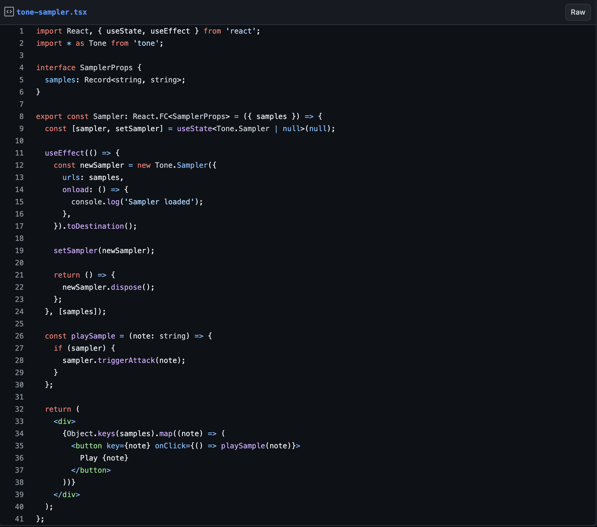
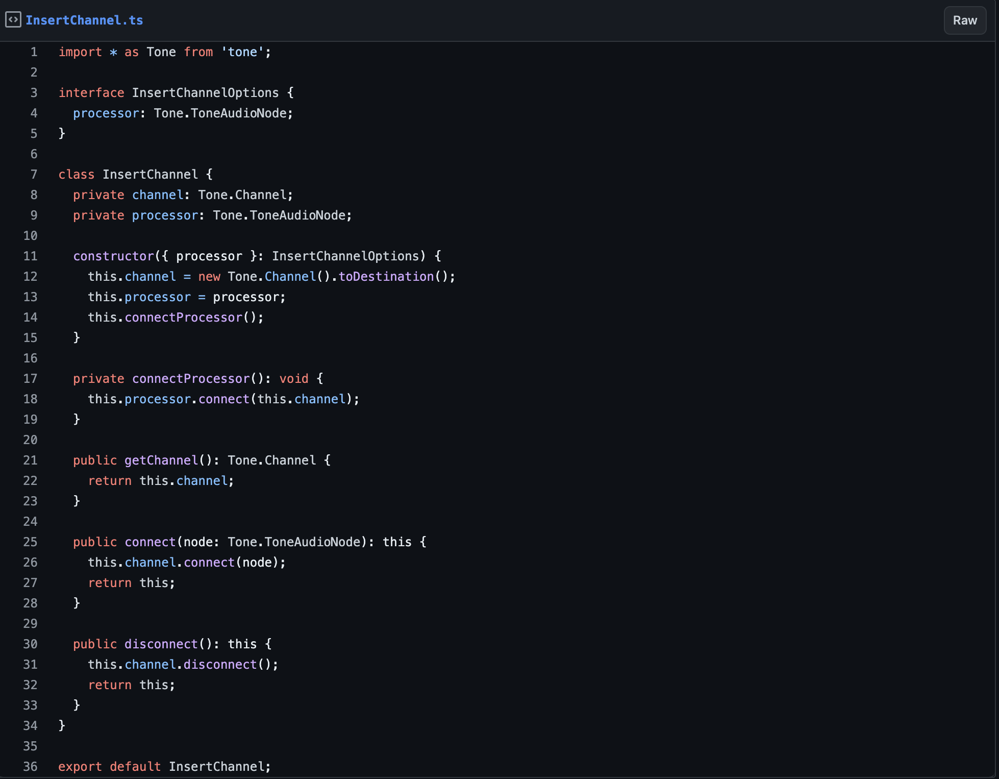
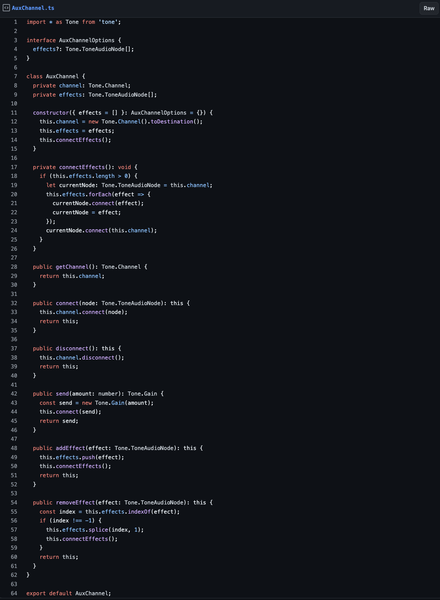
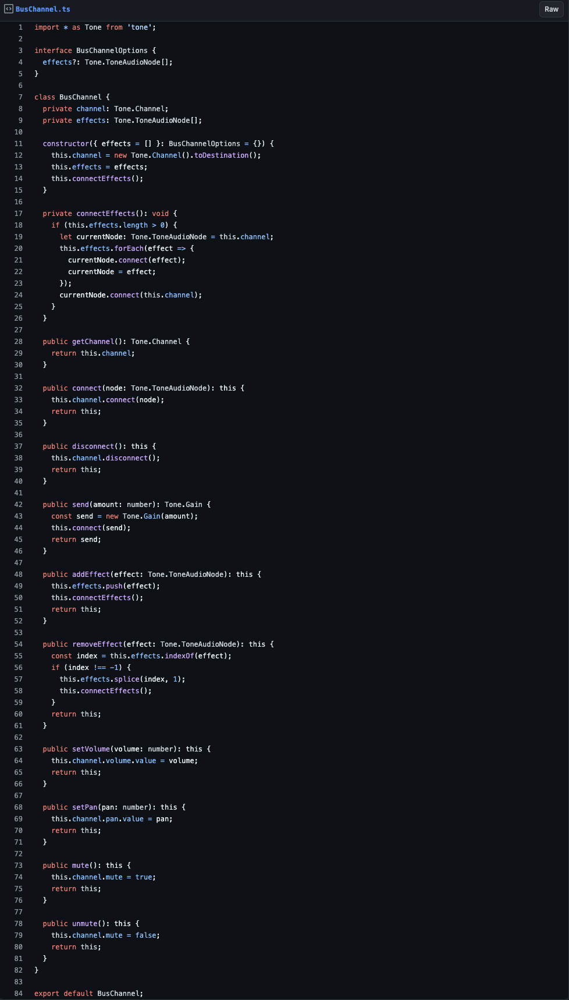
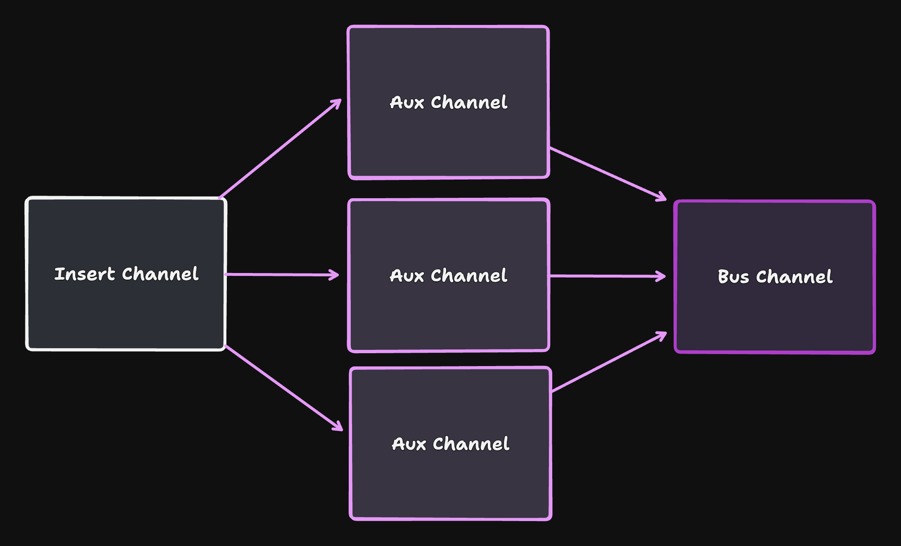

# Sample Based Sound Design with Parallel Processing in Tone.js

[](https://opensource.org/licenses/MIT)
[](https://developer.mozilla.org/en-US/docs/Web/JavaScript)
[](https://tonejs.github.io/)
[](https://developer.mozilla.org/en-US/docs/Web/API/Web_Audio_API)

## Overview

This repository demonstrates how to implement professional-grade sound design using Tone.js, focusing on sample-based synthesis and parallel processing techniques. Whether you're building a music application, creating sound effects for games, or developing AI-powered audio tools, this tutorial will help you master the art of programmatic sound design.

## Why Sound Design Matters

Sound design is crucial in various contexts:
- **Music Production**: Makes the difference between a demo and a hit record
- **Generative Audio**: Helps avoid the "uncanny valley" in AI-generated sounds
- **AI Training**: Enables creation of ethical, copyright-safe datasets for audio model fine-tuning

## Key Concepts

### Sound Design Approaches

1. **Additive Techniques**
   - Combines simple sounds (sine waves, impulses)
   - Creates complex sounds through wave summation
   - More control over individual harmonics

2. **Subtractive Techniques**
   - Starts with harmonically rich audio
   - Shapes sound using filters, compression, and EQ
   - More efficient for certain sound types

### Samples vs Synthesizers

- **Samples**: Pre-recorded sounds that can be manipulated
- **Synthesizers**: Generate sounds electronically
- Both approaches can be used with additive or subtractive methods

## Implementation Guide

### 1. Creating a Sampler



```javascript
// Example sampler implementation
const sampler = new Tone.Sampler({
  urls: {
    "C4": "C4.mp3",
    "D#4": "Ds4.mp3",
    "F#4": "Fs4.mp3",
    "A4": "A4.mp3",
  },
  onload: () => {
    console.log('samples loaded');
  }
}).toDestination();
```

### 2. Audio Channel Setup

#### Insert Channels


```javascript
const insertChannel = new InsertChannel({ processor: someProcessor });
```

#### Aux Channels


```javascript
const reverb = new Tone.Reverb();
const delay = new Tone.FeedbackDelay();
const auxChannel = new AuxChannel({ effects: [reverb, delay] });
```

#### Bus Channels


```javascript
const busChannel = new BusChannel();
busChannel.setVolume(-6); // Set volume to -6 dB
busChannel.setPan(0.5); // Pan slightly to the right
```

### 3. Signal Processing Chain



The signal chain follows this general flow:
1. Sound sources → Insert channels
2. Insert channels → Multiple bus groups
3. Bus groups → Aux channels for effects
4. Final mix → Output

## Usage Examples

### Adding Effects

```javascript
// Add effects to an Aux channel
auxChannel.addEffect(new Tone.Chorus());
auxChannel.removeEffect(delay);

// Add effects to a Bus channel
busChannel.addEffect(new Tone.Reverb());
busChannel.addEffect(new Tone.Chorus());
```

### Audio Routing

```javascript
// Connect instruments to a bus
instrument1.connect(busChannel);
instrument2.connect(busChannel);
instrument3.connect(busChannel);
```

## Best Practices

1. **Signal Flow**
   - Keep your signal chain organized and documented
   - Use bus channels for grouping related sounds
   - Apply effects in parallel when possible

2. **Performance**
   - Monitor CPU usage when using multiple effects
   - Use appropriate buffer sizes for your use case
   - Clean up unused nodes to prevent memory leaks

3. **Sound Design**
   - Start with high-quality source material
   - Use parallel processing for complex sounds
   - Experiment with different effect combinations

## Contributing

Contributions are welcome! Please feel free to submit a Pull Request.

## License

This project is licensed under the MIT License - see the LICENSE file for details.

## Acknowledgments

- [Tone.js](https://tonejs.github.io/) for the amazing Web Audio framework
- The Web Audio API community for continuous innovation
- All contributors who have helped improve this tutorial 

## Read the full post

Read the [full post in my lab](https://lab.greynewell.com/Sample-Based-Sound-Design-with-Parallel-Processing-in-Tone-js-1e97e3cf88c081a89d7fe8e9b0ac5b84) or go to [greynewell.com](https://greynewell.com) for more projects.